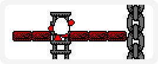

# Climbing

> Putting climbing code into your game may seem like a nightmare, but here you'll find all the code you need to do just that. You should find it relatively simple to add the code, and even easier to add ladders etc into your map.
