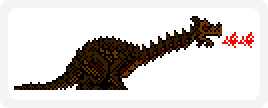

# Dragon



> This effect is possibly one of the most complex, but also one of the most impressive. It shows you how to put a Dragon into your game; including moving the dragon, activating the flame, and placating the dragon.

This page shows all the coding necessary to put a Dragon into your game, including moving the dragon, activating the flame, and placating the dragon.

This code is used in the following game:

- Illusion Island Dizzy
  - [Yolkfolk](http://www.yolkfolk.com/games/illusion-island-dizzy)
  - [DizzyAGE](http://www.yolkfolk.com/dizzyage/game.php?id=146)
  - [DizzyStories](https://dizzyage.github.io/dizzystories/dragon.html)

## Coding the Dragon

The coding shown below is for dragons facing right. if you want the dragon facing left, you will need to alter the 'flame' part of the coding.

Firstly, download and unzip tiles 6001, 6002 and 6003 from here.

Then place in the map a body, 6 neck pieces, a head (use tile 6003, the one that moves), and a flame. Set all 8 dragon tiles (6 neck, 1 body, 1 head) as dynamic objects, with property ANIM = 0

Set user property 43 of the head as a few pixels greater than the Y position of the head. (e.g. if the Y position is 1147, set user property 43 to 1166). User property 43 determines where the head will move to next (so obviously if you draw the head close to the ground, you'll need to set this property to higher than the Y position).

Place a flame in the map, and set property DRAW to 0 (none) and property CLASS to 0 (none).

set IDs for them all, numbering them in sequential order, starting with the Body, then the neck parts from nearest the head down to nearest the body, then the head, then the flame. So for example:

Body ID = 1000
Neck part 1 ID (nearest the head) = 1001
Neck part 2 ID = 1002
Neck part 3 ID = 1003
Neck part 4 ID = 1004
Neck part 5 ID = 1005
Neck part 6 ID (nearest the body) = 1006
Head ID = 1007 Flame ID = 1008

Then set the COLLIDER properties of all of them to 1 (call handler), and set the CLASS properties of all of the body parts (not the flame) to 3 (kill).

Once you've done all that, the map part is complete.

For the coding, open gamedef.gs and put the following code in:

```c++
#def O_DRAGONPOS	43			// next position of dragon head
```

This defines user property 43 as O_DRAGONPOS

Also insert:

```c++
#def G_DRAGONPAUSE	134			// pauses dragon head
```

This is a game variable to store if the dragons head is paused or not.

Save gamedef.gs and open up game.gs, and put the following code in:

```c++
//////////////////////////////////////////////////////////
// Dragons movement
//
// body= ID of main body part (body id is first, then neck parts from head down to body, then head, then flame)
// toppos = highest y position of head
// bodypos = y position of the top of the body
// flameend = where the flame stops moving
//////////////////////////////////////////////////////////
func Move_Dragon(body,toppos,bodypos,flameend)
{
    head = ObjFind(body+7);
    if(!IsUpdate(ObjGet(head,O_DELAY))) return;

    neck = tab(7);
    necky = tab(7);

    heady = ObjGet(head,O_Y);

    nextpos = ObjGet(head,O_DRAGONPOS);

    if(ObjGet(head,O_STATUS)<=2)
    { 
        if(nextpos==heady)
        {
            opt = gs_rand(2);
            if (opt==1) { ObjSet(head,O_STATUS,1); }
            else  { ObjSet(head,O_STATUS,2); }

            ObjSet(head,O_DRAGONPOS,toppos+gs_rand(24));
            nextpos = ObjGet(head,O_DRAGONPOS);
        }

        headx = ObjGet(head,O_X);
    }

    //move head up
    if(heady>nextpos&&ObjGet(head,O_STATUS)==0)
    {
        // cycle through neck parts
        for(ni=1;ni<7;ni++)
        {
            neck[ni]=ObjFind(body+ni);
            necky[ni]=ObjGet(neck[ni],O_Y);

            necky[ni]=bodypos+((heady+4-bodypos-2)/(ni));
            ObjSet(neck[ni],O_Y,necky[ni]);
        }

        // set 1st neck part seperately
        necky[1]=heady+4+((necky[2]-heady-4)/2);
        ObjSet(neck[1],O_Y,necky[1]);

        // set head part
        heady=heady-1;
        ObjSet(head,O_Y,heady);
        return;
    }
    
    //move head down
    if(heady<nextpos&&ObjGet(head,O_STATUS)==0)
    {
        // cycle through neck parts
        for(ni=1;ni<7;ni++)
        {
            neck[ni]=ObjFind(body+ni);
            necky[ni]=ObjGet(neck[ni],O_Y);

            necky[ni]=bodypos+((heady+4-bodypos+2)/(ni));
            ObjSet(neck[ni],O_Y,necky[ni]);
        }

        // set 1st neck part seperately
        necky[1]=heady+4+((necky[2]-heady-4)/2);
        ObjSet(neck[1],O_Y,necky[1]);

        // set head part
        heady=heady+1;
        ObjSet(head,O_Y,heady);
    }

    //stop moving and create flame
    if(ObjGet(head,O_STATUS)==1)
    {
        flame = ObjFind(body+8);
        if(!IsUpdate(ObjGet(flame,O_DELAY))) return;
        if(ObjGet(flame,O_STATUS)==0)
        {
            ObjSet(head,O_FRAME,1);
            ObjSet(flame,O_X,headx+16);
            ObjSet(flame,O_Y,heady+8);
            ObjSet(flame,O_CLASS,3);
            ObjSet(flame,O_DISABLE,0);
            ObjSet(flame,O_DRAW,3);
            ObjSet(flame,O_STATUS,1);
        }
        if(ObjGet(flame,O_W)<40&&ObjGet(flame,O_X)<flameend-ObjGet(flame,O_W))
        {
            ObjSet(flame,O_W,ObjGet(flame,O_W)+8);
            ObjPresent(flame);
        }
        else
        {
            if(ObjGet(flame,O_X)>=flameend-ObjGet(flame,O_W))
            {
                ObjSet(flame,O_W,ObjGet(flame,O_W)-8);
                if(ObjGet(flame,O_W)>=0)
                {
                    ObjSet(head,O_FRAME,0);
                    ObjSet(flame,O_CLASS,0);
                    ObjSet(flame,O_DISABLE,1);
                    ObjSet(flame,O_DRAW,0);
                    ObjSet(head,O_STATUS,0);
                    ObjSet(flame,O_STATUS,0);
                }
            }
            ObjSet(flame,O_X,ObjGet(flame,O_X)+8);
            ObjPresent(flame);
        }
    }
    //stop moving but don't create flame
    if(ObjGet(head,O_STATUS)==2)
    {
        dp = GameGet(G_DRAGONPAUSE);
        dp = dp+1;
        GameSet(G_DRAGONPAUSE,dp);
        if(dp>=10)
        {
            GameSet(G_DRAGONPAUSE,0);
            ObjSet(head,O_STATUS,0);
        }
    }			
    
    //if dragon put to sleep
    if(ObjGet(head,O_STATUS)==3&&heady<bodypos+7)
    {
        flame = ObjFind(body+8);
        ObjSet(flame,O_DISABLE,1);
        ObjSet(flame,O_DRAW,0);
        ObjSet(flame,O_STATUS,0);
        ObjSet(head,O_FRAME,0);

        // cycle through neck parts
        for(ni=1;ni<7;ni++)
        {
            neck[ni]=ObjFind(body+ni);
            necky[ni]=ObjGet(neck[ni],O_Y);

            necky[ni]=bodypos+((heady+4-bodypos+2)/(ni));
            ObjSet(neck[ni],O_Y,necky[ni]);
        }

        // set 1st neck part seperately
        necky[1]=heady+4+((necky[2]-heady-4)/2);
        ObjSet(neck[1],O_Y,necky[1]);

        // set head part
        heady=heady+1;
        ObjSet(head,O_Y,heady);

        if(heady==bodypos+7)
        {
            for(ni=1;ni<7;ni++)
            {
                ObjSet(neck[ni],O_CLASS,0);
            }
            ObjSet(head,O_CLASS,0);
            bodyidx = ObjFind(body);
            ObjSet(bodyidx,O_CLASS,0);
        }
    }
}
```

This is the entire code that deals with moving the dragon, setting the flame position, and moving his head down once placated.

To get the dragon to move, you need to find the room X and Y numbers that the dragon is in from the map, and use the following code also in game.gs:

```c++
func UpdateRoom_RX_RY()
{
    Move_Dragon(BODY,TOPPOS,BODYPOS,FLAMEEND);
}
```

where:

- `RX` is the room X position of the dragon
- `RY` is the room Y position of the dragon
- `BODY` is the ID of the dragon body
- `TOPPOS` is the highest Y position that you want the head to go up to
- `BODYPOS` is the Y position of the body +10 (e.g if body Y position is 1151, - `BODYPOS` would be 1161)
- `FLAMEEND` is the X position in the map that you want the flame to end.

To placate the dragon, use this code in the relevant function:

```c++
head = ObjFind(HEADID);
ObjSet(head,O_STATUS,3);
for(i=BODYID;i<FLAMEID;i++)
{
    idx = ObjFind(i);
    ObjSet(idx,O_CLASS,0);
    ObjSet(idx,O_COLLIDER,0);
}
```

where:

- `HEADID` is the ID of the head
- `BODYID` is the ID of the body
- `FLAMEID` is the ID of the flame

And that's it!
